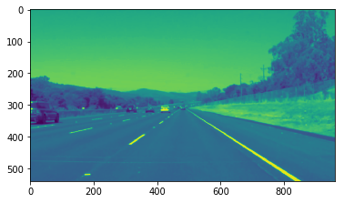
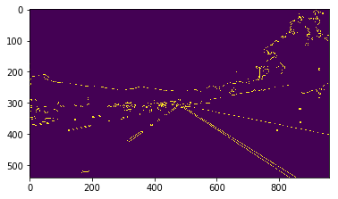
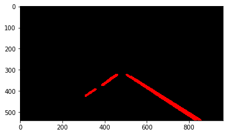

# **Finding Lane Lines on the Road** 

Overview
---

When we drive, we use our eyes to decide where to go.  The lines on the road that show us where the lanes are act as our constant reference for where to steer the vehicle.  Naturally, one of the first things we would like to do in developing a self-driving car is to automatically detect lane lines using an algorithm.

In this project you will detect lane lines in images using Python and OpenCV.  OpenCV means "Open-Source Computer Vision", which is a package that has many useful tools for analyzing images.  

To complete the project, two files will be submitted: a file containing project code and a file containing a brief write up explaining your solution. We have included template files to be used both for the [code](https://github.com/udacity/CarND-LaneLines-P1/blob/master/P1.ipynb) and the [writeup](https://github.com/udacity/CarND-LaneLines-P1/blob/master/writeup_template.md).The code file is called P1.ipynb and the writeup template is writeup_template.md 

To meet specifications in the project, take a look at the requirements in the [project rubric](https://review.udacity.com/#!/rubrics/322/view)

---

## 1. Describe the pipeline

The pipeline consists of 7 steps

**step 1:** Gray-scale

The first step converts the input image into gray-scale, as per the given code.

**step 2:** Gaussian Blur

Next, Gaussian blur is applied with a kernel size of 5. This smooths out the contrast of contiguous pixels.

**step 3:** Canny

The Canny algorithm is applied to extract edges of high contrast from the image

**step 4:** Region of Interest

The images is cropped to a isosceles trapezium, as defined by:
`
imshape = image.shape
xshape_adj = imshape[1]/2
yshape_adj = imshape[0]/2 + 0.1 * imshape[0]
vertices = np.array([[(0,imshape[0]),(xshape_adj - 0.05*xshape_adj, yshape_adj), (xshape_adj + 0.05*xshape_adj, yshape_adj), (imshape[1],imshape[0])]], dtype=np.int32)
`
In the given images the horizon ends a bit further up than halfway, thus the side edges are extended by 10% on the Y axis. Similarly, the top horizontal edge is by 10% smaller than the bottom one, 5% per side.

**step 5:** Hough Transform

The hough transform is applied to extract straight lines

The parameters are:
`
    rho = 2 # distance resolution in pixels of the Hough grid
    theta = np.pi/180 # angular resolution in radians of the Hough grid
    threshold = 15  # minimum number of votes (intersections in Hough grid cell)
    min_line_len = 40 # minimum number of pixels making up a line
    max_line_gap = 20    # maximum gap in pixels between connectible line segments
`

**step 6:** Draw lines

First the identified lines are separated into left and right based on their slope ((y2-y1)/(x2-x1)) being positive or negative respectively.

For each line, the below linear system is solved:

`y = ax + b`

`[x1 , 1 ; x2 , 1] = [y1 ; y2]`

For each group separately, the solutions (a, b) are averaged out by using median. True conditions potentially introduce outliers; a mean average will be greatly affected by those outliers, giving erroneous values for a and b. Median improves on that significantly but not completely. The optional challenge step proves that the effect of the outlier points can be noticeable.

Finally one line is drawn per group. Y1, Y2 values are always constant, being the top corners of the ROI trapezium. Thus the median a, b are used to compute X1 and X2 points.

**step 7:** Draw lines on initial image

The lines are now drawn on the initial unedited image which is returned.

### Alternative Pipeline

For the purposes of solving the optional challenge, I've devised an alternative pipelines. It improves on the original pipeline but does not give excellent results.

The idea is based on color selection from the first sections of this lesson. It is in no way a robust solution.

**alternative step 1:** Region of Interest

The initial image is cropped to the trapezium as defined in the normal pipeline

**alternative step 2:** Color selection & Gray-scale

Color selection is applied where the thresholds are shown below; a list of values denotes the unacceptable range.
`
    red_threshold = 200
    green_threshold = 200
    blue_threshold = (70, 180)
`
Then the image is transformed to gray-scale.

**alternative step 3:** Hough Transform & Draw lines

Hough Transform is applied on the gray-scale color selected image. Parameters are the same as with the normal process.

Finally, the same draw lines method is applied here again.

**conditional alternative step 4:** Fallback

Often the color-selection method failed to identify any lines, leading to an empty output by the Hough Transform. At that point the pipeline falls back to the original pipeline and continues from step 5.

## 2. Identify any shortcomings

The optional challenge proved that the median is not the best function, as it is still affected by a high number of outliers. Color selection is not a viable solution as it greatly depends on lighting and humidity conditions.

## 3. Suggest possible improvements

A potential improvement is the exclusion of outliers. Regression analysis, or the interquartile range are examples on how to proceed.
